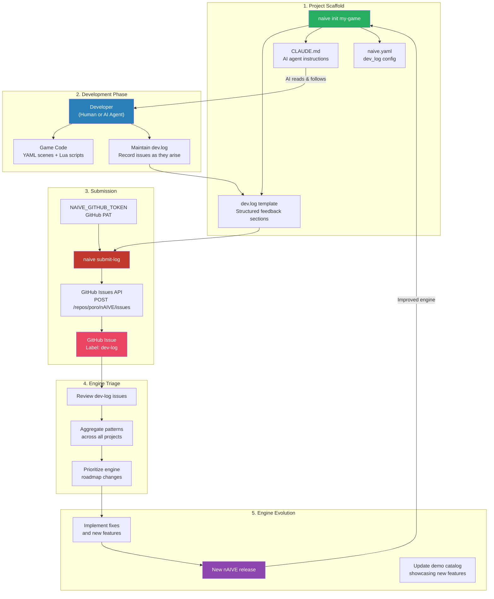
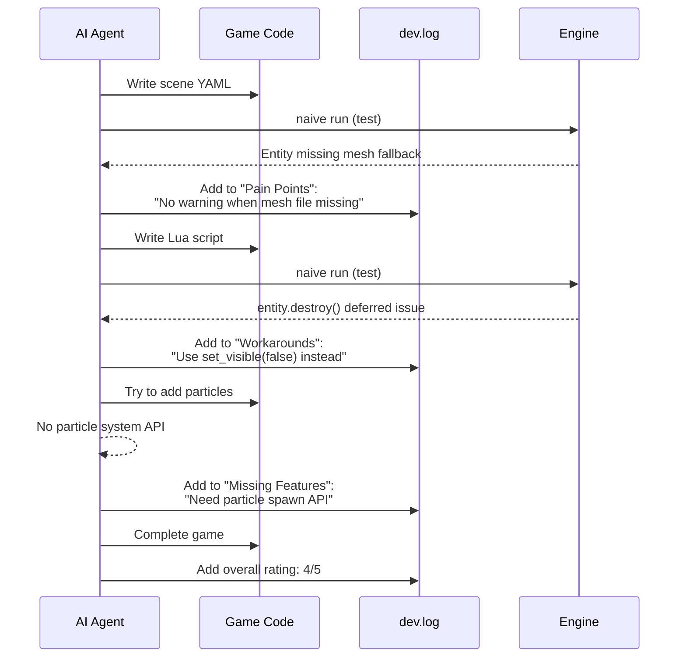
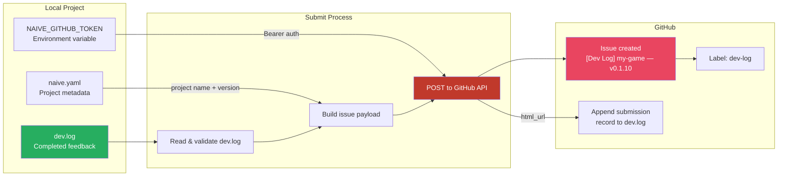
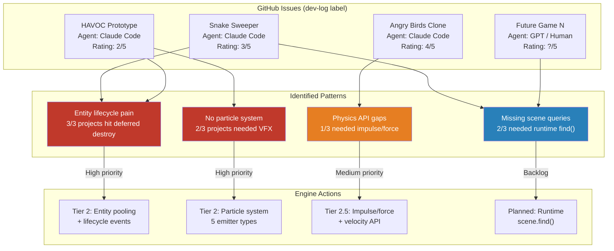
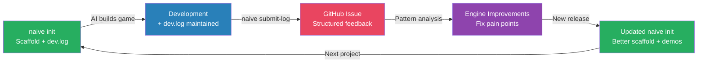

# Dev Log Engine Updates — Architecture & Feedback System

## Overview

The dev.log system is nAIVE's first-class developer feedback loop. Every game project scaffolded with `naive init` includes a structured feedback template (`dev.log`) that captures real-world engine usage data. When submitted via `naive submit-log`, this feedback becomes a permanent, searchable GitHub Issue that directly informs engine roadmap decisions.

This document describes the full architecture: how dev.logs are created, maintained, submitted, triaged, and how they drive engine evolution.

---

## System Architecture



---

## 1. Creation — `naive init`

When a developer runs `naive init my-game`, the scaffold creates three interconnected files that establish the feedback loop:

### dev.log Template

```
# Dev Log — my-game

## Engine Version
nAIVE v0.1.10

## Game Type
<!-- What kind of game? (FPS, puzzle, platformer, RTS) -->

## Agent
<!-- Who is building this? (Claude, GPT-4, human, pair) -->

## Date
<!-- When did development start? -->

---

## What Worked Well
<!-- Engine features that made development smooth -->

## Pain Points
<!-- Frustrating, confusing, or broken parts -->

## Workarounds
<!-- Hacks around engine limitations -->

## Missing Features
<!-- Features that would have made this significantly easier -->

## Performance Notes
<!-- FPS issues, slow loads, memory problems -->

## Overall Rating
Rating: /5
Notes:
```

### CLAUDE.md Instructions

The generated `CLAUDE.md` includes a "Dev Log" section that instructs AI agents:

> This project includes a `dev.log` file for recording engine feedback — what worked, what didn't, pain points, and missing features. This feedback is invaluable for improving the nAIVE engine.
>
> - **Maintain `dev.log`** throughout development — update it as you encounter issues or discover things that work well
> - Run `naive submit-log` to submit your feedback as a GitHub issue

This is critical for the AI-native workflow: AI agents read CLAUDE.md before starting work, so they are automatically instructed to maintain the feedback log as part of their development process.

### naive.yaml Configuration

```yaml
dev_log:
  enabled: true
  submit_on_complete: true
```

The `submit_on_complete` flag signals intent to submit feedback when the project is done. Currently advisory — future versions may auto-prompt.

---

## 2. Development Phase — Maintaining the Log

### Human Developers

Human developers update `dev.log` manually as they encounter issues. The structured sections guide them to record specific, actionable feedback rather than vague complaints.

### AI Agent Developers

AI agents (Claude Code, GPT, etc.) follow the CLAUDE.md instructions and update `dev.log` throughout development. This is the key innovation: **every AI-built game automatically produces structured engine feedback**.



### What Gets Recorded

| Section | What It Captures | Engine Value |
|---------|-----------------|--------------|
| What Worked Well | Features that "just work" | Validates design decisions |
| Pain Points | Confusing APIs, missing docs, crashes | Bugs and DX issues |
| Workarounds | Hacks around limitations | Design gaps |
| Missing Features | What developers wish existed | Roadmap priorities |
| Performance Notes | FPS drops, memory issues | Optimization targets |
| Overall Rating | Satisfaction score | Trend tracking |

---

## 3. Submission — `naive submit-log`

### Data Flow



### Implementation Details

The submission is handled by `crates/naive-client/src/dev_log.rs`:

1. **Read** `dev.log` from project root
2. **Validate** content is non-empty
3. **Check** `NAIVE_GITHUB_TOKEN` environment variable
4. **Build** GitHub Issue payload:
   - Title: `[Dev Log] {project_name} — v{engine_version}`
   - Body: Project metadata + full dev.log contents
   - Labels: `["dev-log"]`
5. **POST** to `https://api.github.com/repos/poro/nAIVE/issues`
6. **Append** submission record to dev.log: `## Submitted: {date} — {issue_url}`

### Authentication

```sh
# Create a GitHub Personal Access Token
# Scope: public_repo (for public engine repo)
export NAIVE_GITHUB_TOKEN=ghp_your_token_here

# Submit feedback
naive submit-log
# → Issue created: https://github.com/poro/nAIVE/issues/42
# → dev.log updated with submission record
```

### Issue Format

The created GitHub Issue contains:

```
**Project:** my-game v0.1.0
**Engine:** nAIVE v0.1.10
**Submitted:** 2026-02-17 14:30

---

# Dev Log — my-game
[... full dev.log contents ...]
```

---

## 4. Triage — Pattern Recognition

### How Dev Logs Drive Engine Changes

The `dev-log` label on GitHub makes all feedback searchable and filterable. The engine maintainer reviews these issues to identify patterns.



### Historical Impact

Every tier of the nAIVE engine roadmap was directly informed by a dev log:

| Dev Log Source | Game Type | Rating | Engine Changes It Drove |
|----------------|-----------|--------|------------------------|
| **Snake Sweeper** (Claude Code, Opus 4.6) | Puzzle | 3/5 | Phase 1.5 Lua API polish: `entity.get_rotation`, `entity.exists`, `camera.world_to_screen`, `entity.set_base_color`, deferred destroy documentation |
| **HAVOC Prototype** (Claude Code) | Vampire Survivors clone | 2/5 | Tier 2 production foundations: dynamic instance buffer (50K+), entity pooling, particle system, event bus, entity lifecycle |
| **Angry Birds Clone** (Claude Code) | Physics puzzle | 4/5 | Tier 2.5 physics & scene API: impulse/force, velocity read/write, CCD, collider materials (restitution/friction), scene loading, camera shake |

Each game exposed blind spots the engine author couldn't anticipate from the inside. The dev.log system makes this feedback loop a **first-class feature** rather than an ad-hoc process.

---

## 5. Engine Evolution — The Feedback Cycle

### The Virtuous Cycle



### Scaling Properties

This system has unique scaling properties for an AI-native engine:

1. **Every AI-built game is a test case.** Traditional engines rely on manual QA and user forums. nAIVE gets structured feedback from every project automatically.

2. **AI agents are thorough reporters.** Unlike human developers who may skip the feedback step, AI agents follow CLAUDE.md instructions consistently and report every issue they encounter.

3. **Feedback is structured, not narrative.** The template sections (Pain Points, Workarounds, Missing Features) make it easy to aggregate across projects. "3 out of 5 projects hit the same deferred destroy confusion" is more actionable than forum posts.

4. **The cost of feedback is zero.** The dev.log is maintained as a side effect of development. Submission is one command. There's no separate feedback form or survey to fill out.

5. **Demo catalog validates fixes.** When a pain point is fixed, it becomes a demo. The `naive demo` catalog serves as proof that reported issues have been resolved.

---

## Technical Implementation

### File: `crates/naive-client/src/dev_log.rs`

```
submit_dev_log(config, project_root)
    ├── Read dev.log from project root
    ├── Validate: non-empty content
    ├── Validate: NAIVE_GITHUB_TOKEN env var
    ├── Build payload:
    │   ├── title: "[Dev Log] {name} — v{engine_version}"
    │   ├── body: metadata header + dev.log contents
    │   └── labels: ["dev-log"]
    ├── POST via ureq to GitHub Issues API
    ├── Parse response for issue URL
    └── Append submission record to dev.log
```

### File: `crates/naive-client/src/init.rs`

```
create_project(name)
    ├── Create directory tree (scenes, logic, assets, ...)
    ├── Write naive.yaml (includes dev_log config)
    ├── Write CLAUDE.md (includes dev.log instructions)
    ├── Write .gitignore (includes !dev.log override)
    ├── Write dev.log template
    ├── Write scene, script, material, pipeline templates
    └── Print getting-started instructions
```

### Dependencies

| Crate | Purpose |
|-------|---------|
| `ureq` v2 | HTTP client for GitHub API |
| `chrono` | Timestamp for submission records |
| `serde_json` | Build/parse JSON payloads |

### Configuration: `naive.yaml`

```yaml
dev_log:
  enabled: true           # Include dev.log in scaffold
  submit_on_complete: true # Advisory flag for submission intent
```

### Environment Variables

| Variable | Required | Description |
|----------|----------|-------------|
| `NAIVE_GITHUB_TOKEN` | For submit-log | GitHub PAT with `public_repo` scope |

---

## Future Enhancements

| Enhancement | Description | Status |
|-------------|-------------|--------|
| Auto-prompt on build | `naive build` prompts to submit dev.log if `submit_on_complete: true` | Planned |
| Sentiment analysis | Parse dev.log ratings to track satisfaction trends | Planned |
| Anonymous submission | Submit without GitHub token via nAIVE relay server | Planned |
| Aggregate dashboard | Web dashboard showing patterns across all dev-log issues | Planned |
| AI triage | Use Claude to auto-categorize and prioritize dev-log issues | Planned |
